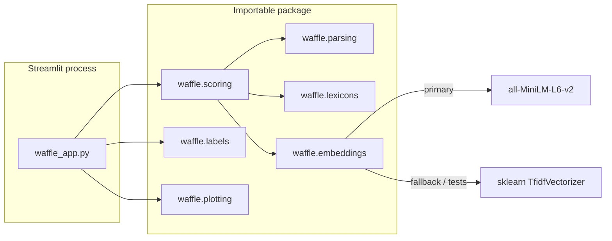

# The Waffle Cube

[](https://github.com/RajeshTharyan/waffle/actions/workflows/tests.yml)
[](https://codespaces.new/RajeshTharyan/waffle)
[](LICENSE)

**A small Streamlit app that scores English prose for waffle** — hedging, buzzwords, topical drift, and missing decisions — along three axes: Substance, Focus, and Actionability.

There is **no hosted demo URL**. The repository is public so a visitor can read the code, run the tests, and (if they want) run a local or Codespaces copy of the UI.

Authors: Haku Rajesh, Rajesh Tharyan, and Insight Companion.

---

## The problem

A lot of workplace writing is grammatically fine and still hard to act on: hedges instead of claims, slogans instead of numbers, repetition instead of a decision. Readability formulas (Flesch, Fog) measure *difficulty*, not *emptiness*.

This project treats that emptiness as something you can approximate with boring, inspectable features:

| Axis | Question the score is trying to answer |
| --- | --- |
| **Substance (S)** | Are there numbers, examples, citations, and specific vocabulary — or hedges and buzzwords? |
| **Focus (F)** | Do sentences stay near a prompt (or the document centroid), or do they repeat / wander? |
| **Actionability (A)** | Are there directives, decisions, dates/KPIs, and structure — or vague verbs? |

Those three numbers are inverted through a sigmoid into a **Waffle Score** (higher = more waffle). The labels (*Blather Vapor*, *Gantt Gladiator*, …) are jokes sitting on top of the same thresholds. They are not a validated writing-quality instrument.

---

## What a visitor should infer

This is a **skills-showcase repo**, not a research paper and not a product. If you only skim, this is the honest mapping:

| If you look at… | You can reasonably infer… | You should **not** infer… |
| --- | --- | --- |
| `waffle/parsing.py`, `waffle/lexicons.py` | Comfort with regex, tokenisation, and lexicon-based feature extraction | Production NLP or multilingual linguistics |
| `waffle/scoring.py` | Ability to turn mixed signals into bounded, weighted indices and document the formula | A fitted model, an evaluation set, or causal claims about “good writing” |
| `waffle/embeddings.py` | Sentence-transformer use with a **real TF-IDF fallback** when the model cannot load | Custom embedding training or retrieval systems |
| `waffle/plotting.py` + `waffle_app.py` | A thin UI over a library; Plotly for a 3D point in `(S, F, A)` | A design system, auth, or multi-page app architecture |
| `tests/`, `.github/workflows/tests.yml` | The scoring path is testable without a browser, GPU, or Hugging Face download | High coverage of Streamlit, Docker, or the MiniLM path in CI |
| `Dockerfile`, `.devcontainer/`, `captain-definition` | The same entry file (`waffle_app.py`) can run locally, in Codespaces, in Docker, or on CapRover | That a public instance is already deployed |

---

## Architecture



Design choices worth noticing:

- **UI is a client, not the product.** `waffle_app.py` wires widgets, `st.session_state` for tagline history, and Plotly. Scoring does not import Streamlit, so pytest can call it like a library.
- **Primary embeddings, explicit fallback.** If `sentence-transformers` (or the MiniLM weights) cannot load, Focus still runs in a shared TF-IDF space. Tests set `WAFFLE_EMBEDDINGS=tfidf` so CI never downloads a model.
- **Hand-weighted formulae, not a classifier.** Substance / Focus / Actionability are linear combinations of normalised densities, then clipped to `[0, 1]`. The waffle composite is `1 - σ(0.5S + 0.3F + 0.2A − 0.5)`. Weights were adjusted by inspection, not by training.
- **Focus is geometric, not rhetorical.** Cosine similarity to the prompt (and to the document centroid), mean pairwise similarity (redundancy), share of low-similarity sentences (drift), and consecutive similarity deltas (progression). That is a useful proxy. It is not discourse parsing.

### Formulae (as implemented)

**Substance**

`S = 0.30·n̂ + 0.15·êx + 0.15·ĉi + 0.20·t̂tr − 0.10·ĥ − 0.10·bẑ`

Numbers/currency, example cues, citation-like strings, type–token ratio; minus hedge and buzzword density.

**Focus**

`F = 0.50·ŝim − 0.25·r̂ed − 0.10·d̂rift + 0.15·p̂rog`

**Actionability**

`A = 0.35·d̂ir + 0.25·ôut + 0.20·dêc + 0.10·ŝtruct − 0.10·âmb`

Each hat-variable is min–max normalised with hardcoded low/high cutoffs in `waffle/scoring.py`.

---

## Using the app in the browser

Once Streamlit is running (local, Docker, or Codespaces preview on port **8501**):

1. Paste English prose, or upload a `.txt` / `.md` file (you can do both; they are concatenated).
2. Optionally edit **Prompt / Question**. A tighter prompt usually changes the Focus similarity feature; it is not a Q&A model.
3. Click **Analyse**. If the combined text is longer than 10 characters, analysis also runs on rerun without the click — that is existing behaviour, not a separate “live” mode.
4. Read the four metrics, the two-sentence diagnostics, the raw feature JSON, and the 3D cube (one point at your `(S, F, A)`).

The caption shows the embeddings backend (`sentence-transformers` or `tfidf-fallback`). First MiniLM load can take a while and needs a download of the weights.

---

## Run or deploy a copy

**Local**

```bash
python -m venv .venv
source .venv/bin/activate
pip install -r requirements.txt
streamlit run waffle_app.py
```

**Tests** (no Streamlit, no torch):

```bash
pip install -r requirements-dev.txt
WAFFLE_EMBEDDINGS=tfidf python -m pytest
```

**GitHub Codespaces** — this repo has a Dev Container. [Open in Codespaces](https://codespaces.new/RajeshTharyan/waffle); attach runs `streamlit run waffle_app.py` and forwards 8501.

**Docker**

```bash
docker build -t waffle-cube .
docker run --rm -p 8501:8501 waffle-cube
```

**CapRover** — `captain-definition` points at the same Dockerfile.

**Streamlit Community Cloud** — create an app pointed at `waffle_app.py` on this repo. **No Community Cloud (or other) demo is published from this repository**; do not assume `*.streamlit.app` exists until someone deploys one.

---

## Honest limits

- **Heuristic, English-centric, business-prose flavoured.** Lexicons are small word lists. Inflected forms (`exploring` vs `explore`) are often missed.
- **Naive sentence splitting.** Split on `.?!` followed by a capital or digit. Abbreviations and lists will confuse it.
- **No labelled waffle corpus.** There is no precision/recall story. “Concrete text scores higher on S and A than buzzword text” is the test, not a user study.
- **MiniLM is off-the-shelf.** `all-MiniLM-L6-v2` is used as a generic sentence embedder. Nothing here is fine-tuned.
- **TF-IDF fallback is weaker for Focus**, especially on short prompts that share little vocabulary with the document.
- **Uploads stay in the Streamlit session** (UTF-8, errors ignored). The app does not fetch URLs it finds in the text. See [SECURITY.md](SECURITY.md).
- **Not a writing tutor.** It will happily punish cautious academic hedging and reward bullet-pointed plans. That is a bias, not a philosophy.

---

## Layout

```
waffle_app.py          # Streamlit entry (keep this filename for Docker / Codespaces)
waffle/                # importable scoring library
  parsing.py           # sentences, tokens, densities
  lexicons.py          # hedges, buzzwords, patterns, taglines
  embeddings.py        # MiniLM or TF-IDF
  scoring.py           # S, F, A, WaffleScore
  labels.py            # bins, diagnostics, tagline rotation
  plotting.py          # Plotly cube
tests/                 # pytest, TF-IDF only
```

License: [MIT](LICENSE). How to send a patch: [CONTRIBUTING.md](CONTRIBUTING.md).
